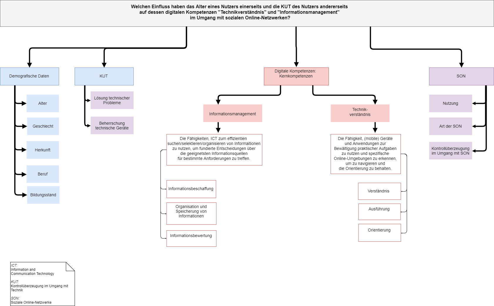
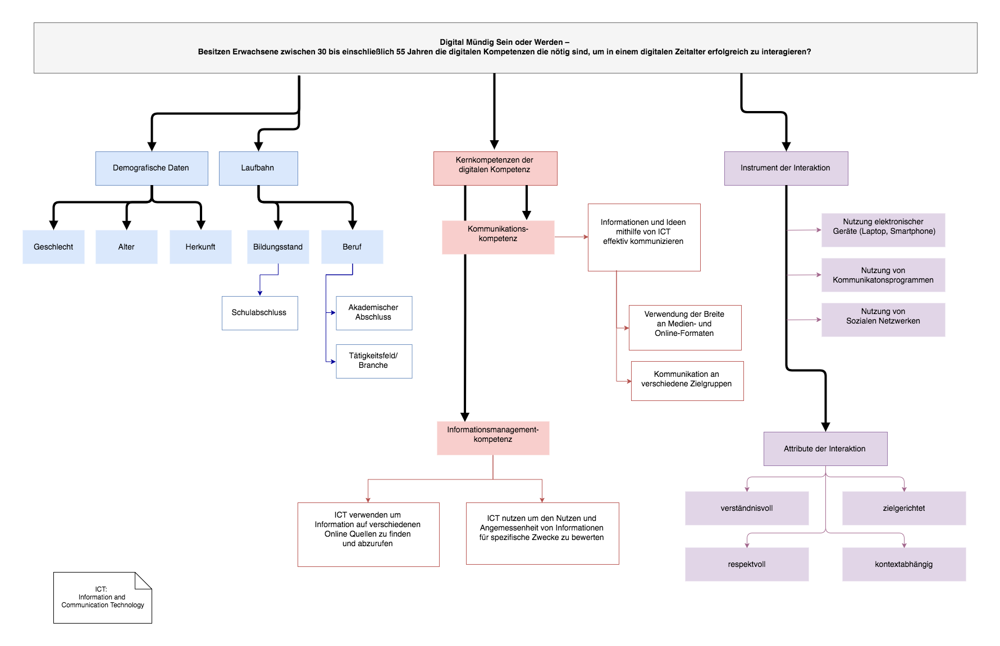

## Digitale Kompetenzen
In diesem Forschungsprojekt sollen Digitale Kompetenzen im Rahmen der Digitalen Mündigkeit untersucht werden.

#### Teammitglieder
frepai
kathiwa
meleina
nicibolt
pauline05019
tsheesy

#### Forschungsfrage
Welchen Einfluss haben das Alter eines Nutzers einerseits und die KUT des Nutzers andererseits auf dessen digitalen Kompetenzen "Technikverständnis" und "Informationsmanagement" im Umgang mit sozialen Online-Netzwerken?

#### Unterschieds- und Nullhypothesen
##### 1. Unterschiedshypothese:
H0: Es besteht kein Unterschied zwischen den digitalen Kompetenzen „Technikverständnis” und „Informationsmanagement” im Umgang mit sozialen Online-Netzwerken abhängig vom Alter.
H1: Es besteht ein Unterschied zwischen den digitalen Kompetenzen „Technikverständnis” und „Informationsmanagement” im Umgang mit sozialen Online-Netzwerken abhängig vom Alter.

##### 2. Unterschiedshypothese:
H0: Es besteht kein Unterschied zwischen den digitalen Kompetenzen „Technikverständnis” und „Informationsmanagement” im Umgang mit sozialen Online-Netzwerken abhängig von der KUT.
H1: Es besteht ein Unterschied zwischen den digitalen Kompetenzen „Technikverständnis” und „Informationsmanagement” im Umgang mit sozialen Online-Netzwerken abhängig von der KUT.

##### 3. Unterschiedshypothese:
H0: Es besteht kein Unterschied zwischen der KUT abhängig vom Alter.
H1: Es besteht ein Unterschied zwischen der KUT abhängig vom Alter.

__

#### Faktorenraum

*_Frühere Versionen:_*

Diese Version wurde am 05.11.2018 aus folgenden Gründen angepasst:

* Nur eine unabhängige Variable und zwei abhängige Variablen
* Zu wenige Nutzerfaktoren
* Zu wenige mögliche Hypothesen

Diese Version wurde am 02.11.2018 aus folgenden Gründen angepasst:

* Unklare Formulierung "erfolgreiche Interaktion"
* Einschränkung Alter (30-55 Jahre)

*_Stand 29.11.2018_*
* Der Fragebogen wurde in der vergangenen Woche mit Surveymonkey für den Testdurchlauf fertiggestellt.
* Mithilfe von sechs selbstproduzierten Dummy-Datensätzen (Alter 99) wurde ein Datacleaning durchgeführt.
