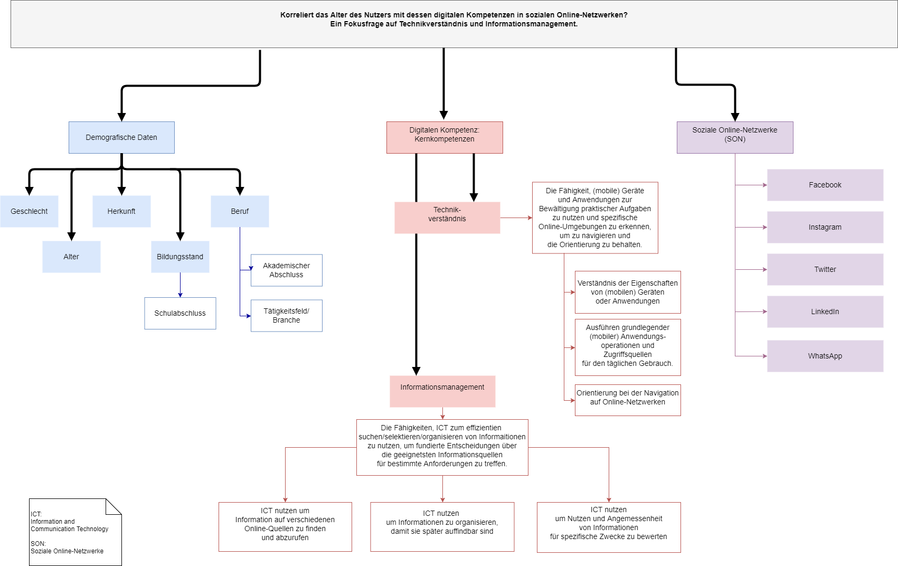

## Digitale Kompetenzen
In diesem Forschungsprojekt sollen Digitale Kompetenzen im Rahmen der Digitalen Mündigkeit untersucht werden.

#### Teammitglieder
frepai
kathiwa
meleina
nicibolt
pauline05019
tsheesy

#### Forschungsfrage
Welchen Einfluss haben das Alter eines Nutzers einerseits und die KUT des Nutzers andererseits auf dessen digitalen Kompetenzen "Technikverständnis" und "Informationsmanagement" im Umgang mit sozialen Online-Netzwerken?

#### Unterschieds- und Nullhypothesen

### Unterschiedshypothesen 

## Hypothese 1:
H1: Es besteht ein Unterschied zwischen dem Alter einer Person und der Ausprägung digitaler Kompetenzen im Umgang mit sozialen Online-Netzwerken.  
H0: Es besteht kein Unterschied zwischen dem Alter einer Person und der Ausprägung digitaler Kompetenzen im Umgang mit sozialen Netzwerken. 
(>>one-way Manova, da eine UV und 3 AVs?)

## Hypothese 2: 
H1: Es besteht ein Unterschied zwischen der KUT und der Ausprägung ihrer digitalen Kompetenz „Technikverständnis“. 
H0: Es besteht kein Unterschied zwischen der KUT und der Ausprägung ihrer digitalen Kompetenz „Technikverständnis“. 
(>> one-way Anova, da eine UV und eine AV?)

## Hypothese 3: 
H1: Es besteht ein Unterschied zwischen der KUT und der Ausprägung ihrer digitalen Kompetenz „Informationsmanagement“. 
H0: Es besteht kein Unterschied zwischen der KUT und der Ausprägung ihrer digitalen Kompetenz „Informationsmanagement“. 
(>> one-way Anova, da eine UV und eine AV?)

## Hypothese 4: 
H1: Es macht einen Unterschied in KUT, ob ein Mensch eine hohe Ausprägung digitaler Kompetenzen hat oder nicht. 
H0: Es macht keinen Unterschied in KUT, ob ein Mensch eine hohe Ausprägung digitaler Kompetenzen hat oder nicht. 
(>> verbundener T-Test?)

## Hypothese 5:
H1: Es macht einen Unterschied im Umgang mit sozialen Online-Netzwerken, ob ein Mensch eine hohe KUT (4,5-6) hat oder eine niedrige KUT (0-4,4) hat. 
H0: Es macht keinen Unterschied im Umgang mit sozialen Online-Netzwerken, ob ein Mensch eine hohe KUT (4,5-6) hat oder eine niedrige KUT (0-4,4) hat. 
(>> two-way Anova, da zwei UVs und eine AV?)

## Hypothese 6:
H1: Es macht einen Unterschied im Umgang mit sozialen Online-Netzwerken, ob ein Mensch eine hohe Ausprägung digitaler Kompetenzen (4,5-6) hat oder nicht. 
H0: Es macht keinen Unterschied im Umgang mit sozialen Online-Netzwerken, ob ein Mensch eine hohe Ausprägung digitaler Kompetenzen (4,5-6) hat oder nicht. 

#### Zusammenhangs- und Nullhypothesen

## Hypothese 1
H1: Es besteht ein Zusammenhang zwischen dem KUT eines Nutzers und dessen digitalen Kompetenzen.
H0: Es besteht kein Zusammenhang zwischen dem KUT eines Nutzers und dessen digitalen Kompetenzen.

## Hypothese 2:
H1:Es besteht ein Zusammenhang zwischen dem Alter und dem Umgang mit sozialen Online-Netzwerken.
H0: Es besteht kein Zusammenhang zwischen dem Alter und dem Umgang mit sozialen Online-Netzwerken.

##Hypothese 3:
H1: Ist die digitale Kompetenz “Technikverständnis” stark ausgeprägt, ist auch die digitale Kompetenz “Informationsmanagement” stark ausgeprägt.
H0:  Es besteht kein Zusammenhang in der Stärke der Ausprägung der digitalen Kompetenz “Technikverständnis” und der Stärke der Ausprägung der digitalen Kompetenz “Informationsmanagement”.

#### Vorschlag zur Vereinfachung der Schluesselliste ----

#schluesselliste <- list( ON_SON= c("on_fb", "on_ig", "on_tw", "on_sc", "on_yt", "on_other"),
                          TECH = c("tech_1", "tech_2", "-tech_3", "tech_4", "tech_5", "-tech_6"),
                          KUT = c("kut_1", "-kut_2", "kut_3", "kut_4", "-kut_5", "kut_6", "-kut_7","-kut_8"),
                          TECH_VERS = c("tvv_1", "tva_1", "tva_2", "tva_3", "tva_4", "tva_5", "tvo_1","tvo_2", "tvo_3", "blog_1"),
                          INF_MAN = c("IMIBpl_1", "IMIBpl_2", "IMIBpl_3", "-IMOSImin_1", "-IMOSImin_2","IMOSIpl_1", "IMIBwertpl_1",                           "IMIBwert_1","-MIBwert_3","MIBwert_4","socialbots_1", "socialbots_2", "blog_2"),
                          SON_USE = c("son_use_1", "-son_use_2", "-son_use_3", "son_use_4","-son_use_5", "son_use_6", "-son_use_7"))
                        
#BEGRÜNDUNG: „blog_2“  Verfolgung Blog  IMIBschaff: Informationsmanagement – Informationsbeschaffung; "socialbots_1" + "socialbots_2”  Einsatz und Nachrichten von SB  MIBwert: Informationsmanagement – Informatnsbewertung; „blog_1“  Führen eines eigenen blogs  TVA: Technikverständnis – Ausführung

##### Hinweise zum Umgang mit P-Values
Der p-Wert wird definiert als: „Die Wahrscheinlichkeit des beobachteten Ergebnisses (inkl. extremerer Ergebnisse), wenn die Nullhypothese stimmt.“ Es wird immer mit der Voraussetzung der Richtigkeit der Nullhypothese gearbeitet. Oftmals wird der p-Wert genau gegenteilig und damit falsch verstanden - nämlich als die Wahrscheinlichkeit, dass die Nullhypothese sich als richtig erweist. Der p-Wert sagt also NICHT aus, wie wahrscheinlich die Nullhypothese ist. Je geringer der p-Wert ist, desto unwahrscheinlicher ist die Richtigkeit der Nullhypothese. Es besteht jedoch ein Zusammenhang zwischen einem kleinen p-Wert und der Alphafehlerwahrscheinlichkeit.
Als Wahrscheinlichkeitswert kann der p-Wert Werte von 0-1 annehmen. In der Kommunikationswissenschaft liegt der gängige Signifikanzwert bei 5%. Ist der p-Wert kleiner als 5%, wird die Nullhypothese verworfen. Als statistisch signifikant bewertet wird das Ergebnis einer Befragung, sobald die Nullhypothese aufgegeben und die Alternativhypothese angenommen wird. Allerdings sagt ein signifikantes Ergebnis nichts über den tatsächlichen Wahrheitsgehalt einer Hypothese aus. 
Kritiker dieses Wertes sprechen von willkürlich festgelegten Grenzen, die die Signifikanz einer Umfrage deutlich beeinflussen. Ein weiterer Kritikpunkt: Der p-Wert gibt keine geraden Ergebnisse über die Wahrscheinlichkeit einer Hypothese, sondern nimmt den Exkurs über die Wahrscheinlichkeit der Ergebnisse.  

Quellen: A Dirty Dozen: Twelve P-Value Misconceptions – Steven Goodman
http://www.perfendo.org/docs/BayesProbability/twelvePvaluemisconceptions.pdf

__

#### Faktorenraum

*_Frühere Versionen:_*

Diese Version wurde am 05.11.2018 aus folgenden Gründen angepasst:

* Nur eine unabhängige Variable und zwei abhängige Variablen
* Zu wenige Nutzerfaktoren
* Zu wenige mögliche Hypothesen

Diese Version wurde am 02.11.2018 aus folgenden Gründen angepasst:

* Unklare Formulierung "erfolgreiche Interaktion"
* Einschränkung Alter (30-55 Jahre)

*_Stand 29.11.2018_*
* Der Fragebogen wurde in der vergangenen Woche mit Surveymonkey für den Testdurchlauf fertiggestellt.
* Mithilfe von sechs selbstproduzierten Dummy-Datensätzen (Alter 99) wurde ein Datacleaning durchgeführt.

*_Stand 06.12.2018_*
* Für die weitere Erhebung wurdem Nullhypothesen und Unterschiedshypothesen hinzugefügt. Durch Two-Sample-Tests können die zu erwartenden Beobachtungen zur Interpretation beitragen.
