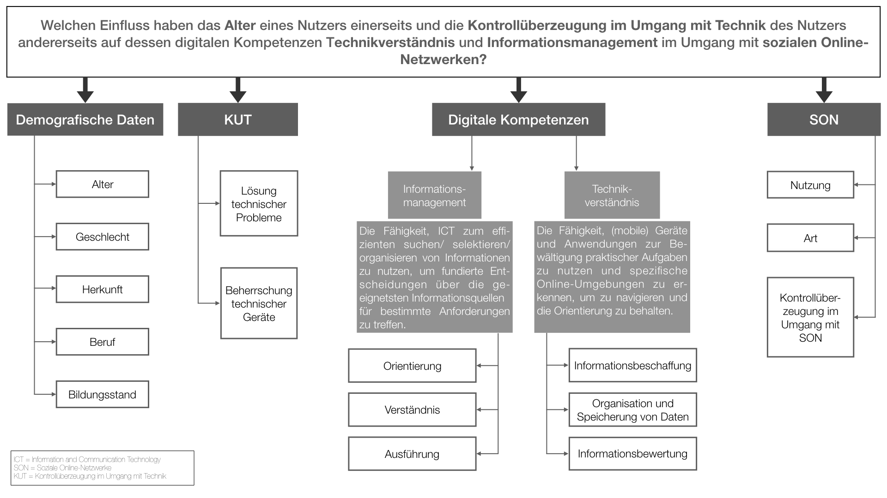

# Digitale Kompetenzen
In diesem Forschungsprojekt sollen Digitale Kompetenzen im Rahmen der Digitalen Mündigkeit untersucht werden.

## Teammitglieder
Melina Danieli, Pauline Heger, Nicole Herbolt, Freya Paintner, Katharina Wagner

## 1. Forschungsfrage
Welchen Einfluss haben das Alter eines Nutzers einerseits und die KUT des Nutzers andererseits auf dessen digitalen Kompetenzen "Technikverständnis" und "Informationsmanagement" im Umgang mit sozialen Online-Netzwerken?

## 2. Faktorenraum

## 3. Hypothesen ----

### Hypothese 1:
H1: Es besteht ein Unterschied zwischen jüngeren und älteren Personen in deren digitalen Kompetenzen Technikverständnis und Informationsmanagement.  

### Hypothese 2
H2: Es besteht ein Zusammenhang zwischen dem KUT eines Nutzers und dessen digitalen Kompetenzen Technikverständnis und Informationsmangement.

### Hypothese 3:
H3:Es besteht ein Zusammenhang zwischen dem Alter und der Nutzung von sozialen Online-Netzwerken.

### Hypothese 4:
H4:Es besteht ein Zusammenhang zwischen dem KUT und der Nutzung von sozialen Online-Netzwerken.

## 4. Hinweise zum Umgang mit P-Values
Der p-Wert wird definiert als: „Die Wahrscheinlichkeit des beobachteten Ergebnisses (inkl. extremerer Ergebnisse), wenn die Nullhypothese stimmt.“ Es wird immer mit der Voraussetzung der Richtigkeit der Nullhypothese gearbeitet. Oftmals wird der p-Wert genau gegenteilig und damit falsch verstanden - nämlich als die Wahrscheinlichkeit, dass die Nullhypothese sich als richtig erweist. Der p-Wert sagt also NICHT aus, wie wahrscheinlich die Nullhypothese ist. Je geringer der p-Wert ist, desto unwahrscheinlicher ist die Richtigkeit der Nullhypothese. Es besteht jedoch ein Zusammenhang zwischen einem kleinen p-Wert und der Alphafehlerwahrscheinlichkeit.
Als Wahrscheinlichkeitswert kann der p-Wert Werte von 0-1 annehmen. In der Kommunikationswissenschaft liegt der gängige Signifikanzwert bei 5%. Ist der p-Wert kleiner als 5%, wird die Nullhypothese verworfen. Als statistisch signifikant bewertet wird das Ergebnis einer Befragung, sobald die Nullhypothese aufgegeben und die Alternativhypothese angenommen wird. Allerdings sagt ein signifikantes Ergebnis nichts über den tatsächlichen Wahrheitsgehalt einer Hypothese aus. 
Kritiker dieses Wertes sprechen von willkürlich festgelegten Grenzen, die die Signifikanz einer Umfrage deutlich beeinflussen. Ein weiterer Kritikpunkt: Der p-Wert gibt keine geraden Ergebnisse über die Wahrscheinlichkeit einer Hypothese, sondern nimmt den Exkurs über die Wahrscheinlichkeit der Ergebnisse.

## 5.Dokumentation Forschungsstand ----

### Stand 20.01.2018
*Ein neuer, grafisch aufbereiteter Forschungsraum wurde hochgeladen.

### Stand 14.01.2018
*Der neue Datensatz wurde implementiert und die Dummydatensätze (age=99) herausgelöscht.

### Stand 10.01.2018
* Unterschieds- und Zusammenhangshypothesen wurden angepasst. Entsprechende Tests zur Überprüfung Hypothesen angepasst. 
* Vorschlag zur Verkürzung der Schlüsselliste in AnalyseScript eingefügt.

### Stand 06.12.2018
* Für die weitere Erhebung wurdem Nullhypothesen und Unterschiedshypothesen hinzugefügt. 
* Durch Two-Sample-Tests können die zu erwartenden Beobachtungen zur Interpretation beitragen.

### Stand 29.11.2018
* Der Fragebogen wurde in der vergangenen Woche mit Surveymonkey für den Testdurchlauf fertiggestellt.
* Mithilfe von sechs selbstproduzierten Dummy-Datensätzen (Alter 99) wurde ein Datacleaning durchgeführt.

## 6. Frühere Versionen des Faktorenraums:

### Diese Version wurde am 05.11.2018 aus folgenden Gründen angepasst:

* Nur eine unabhängige Variable und zwei abhängige Variablen
* Zu wenige Nutzerfaktoren
* Zu wenige mögliche Hypothesen

### Diese Version wurde am 02.11.2018 aus folgenden Gründen angepasst:

* Unklare Formulierung "erfolgreiche Interaktion"
* Einschränkung Alter (30-55 Jahre)

### 7. Quellen

Ahmad, M. et. al. 2016. The application of 21st century ict literacy model among teacher trainees. Turkish Online Journal of Educational Technology, 15(3), 151-161. 

Bakó, R., & Tőkés, G. (2017). Strangers in Digiland. Acta Universitatis Sapientiae
Communicatio, 4(1), 109-115. doi: 10.1515/auscom-2017-0006 

Freiman, V., Godin, J., Larose, F., Léger, M., Chiasson, M., Volkanova, V., Goulet, M.-J.
(2017). Towards the life-long continuum of digital competences_ exploring combination
of soft-skills and digital skills development. INTED2017 Proceedings, 9518-9527.

Goodman, S. A Dirty Dozen: Twelve P-Value Misconceptions. Verfügbar unter:
http://www.perfendo.org/docs/BayesProbability/twelvePvaluemisconceptions.pdf

Janssen, J., Stoyanov, S., Ferrari, A., Punie, Y., Pannekeet, K., & Sloep, P. (2013). Experts'
views on digital competence: Commonalities and differences. Computers & Education,
68, 473-481. doi: 10.1016/j.compedu.2013.06.008

Karrer, K, et. al. 2009. Technikaffinität erfassen – der Fragebogen TA-EG. In: A. Lichtenstein, C. Stößel, & C. Clemens (Eds.), Der Mensch im Mittelpunkt technischer Systeme.8. Berliner Werkstatt Mensch-Maschine-Systeme 7. bis 9. Oktober 2009 (pp.196-201). Düsseldorf, Germany: VDI.

Ng, W. 2012. Can we teach digital natives digital literacy?. Computer & Education 59(3), 1065-1078.

van Laar, E. et. al. 2017. The relation between 21st-century skills and digital skills: A systematic literature review. Computers in Human Behavior, 72, 577-588.

Young, J. (2015). Assessing New Media Literacies in Social Work Education: The
Development and Validation of a Comprehensive Assessment Instrument. Journal Of
Technology In Human Services, 33(1), 72-86. doi: 10.1080/15228835.2014.998577 
